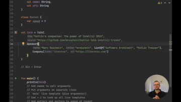

# Talk: Kotlin's companion: The power of IntelliJ IDEA

Kotlin's power is coming not only by its syntax, but also by its awesome IDE integration. IntelliJ is full of great
helpers and shortcuts that makes us more productive - and has some extras that make Kotlin development even better!

This talk is done completely in IntelliJ IDEA - just open up this project there and follow along the samples yourself! 🙌

Or simply have a look at those tips & tricks [here](src/main/java/).

[Follow me on Twitter](https://twitter.com/mreichelt) to reach out and for questions. Also, you can watch the first
recording of the talk on YouTube:

[https://youtube.com/watch?v=p-6bBCBhCDA](https://youtube.com/watch?v=p-6bBCBhCDA)

Join the discussion in [Kotlin Slack](https://kotlinlang.slack.com/messages/CM6CU9RGV) to learn more tips & tricks
(get invite [here](https://slack.kotlinlang.org/)) - and especially for adding yours as well! 🌟
